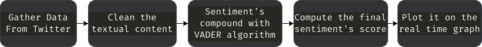

# Sentiment Analysis Tool for Twitter :

## 

---

#### Pipeline

1. Gather Data, extract creation date, textual content, number of followers and likes
2. Clean the textual content from http links, pseudo, images and videos
3. Compute its sentiment's compound with VADER algorithm
4. Compute the final sentiment's score with the number of followers and likes
5. Plot it on the realtime graph

## 

---

- #### Gather Data from Twitter
  
  - Use hastag, target celebrity handles
  - For each tweets we extracted the following informations:
    - ID
    - Text
    - Username
    - Number of followers of the user
    - Number of retweets
    - Number of likes
    - Creation date

---

- #### Preprocessing

  

  - For the preprocessing, we remove all of the useless data from the tweets, such as HTTP links, @pseudo tags, images, videos and hashtags (#happy->happy). We finally stored them in a CSV file.
  - Once the cleaned files are obtained, we process the sentiment analysis on each textual content of the tweet to obtain a sentiment score named compound.
  - This compound is then multiplied by the number of followers of the user and the number of likes to emphasize the importance of the sentiment.
  - Here is the calculation made on the compound to obtain the tweet's score:
    - tweet's score = (#like + #follower) \* compound
  - If the tweet comes from an influencer, the number of followers will be high, so the score will be.
  - If it is retweeted by a lambda person with a dozen of followers, the score will be small.
  - Finally, after the tweets have been fully processed, we end up with two features:
    1. the creation date of the tweet
    2. the score of the tweet where a negative value indicates a bad sentiment, a positive a good sentiment and a zero indicates a neutral sentiment.

---

### Techniques and algorithms

- ##### Sentiment analysis - vaderSentiment
  - **VADER** (Valence Aware Dictionary and sEntiment Reasoner) is a lexicon and rule-based sentiment analysis tool that is specifically attuned to sentiments expressed in social media. It is fully open-sourced under the [MIT License]
  - For the analysis of the sentiment we use the VADER algorithm. There is a great implementation in Python called vaderSentiment. https://github.com/cjhutto/vaderSentiment.
  - Here is a description of the 3 sentiment analysis algorithms that we considered.
    1. **Polarity classification** :
       Since the rise of social media, a large part of the current research has been focused on classifying natural language as either positive or negative sentiment. Polarity classification have been found to achieve high accuracy in predicting change or trends in public sentiment, for a myriad of domains (e.g. stock price prediction).
    2. **Lexicon-based approach**
       A lexicon is a collection of features (e.g. words and their sentiment classification). The lexicon-based approach is a common method used in sentiment analysis where a piece of text is compared to a lexicon and attributed sentiment classifications. Lexicons can be complex to create, but once created require little resources to use. Well designed lexicons can achieve a high accuracy.
    3. **VADER**
       Valence Aware Dictionary and sEntiment Reasoner (VADER) is a combined lexicon and rule-based sentiment analytic software, developed by Hutto and Gilbert. VADER is capable of both detecting the polarity (positive, neutral, negative) and the sentiment intensity in text. The authors have published the lexicon and python specific module under an MIT License, thus it is considered open source and free to use.
       The VADER algorithm uses negations et contractions (not good, wasn’t good), ponctuation (good!!!), capital letters, emotes :), emojis, intensificators (very, kind of), acronyms (lol) and other factors to calculate the scores. It outputs a compound score between -1 (negative) and 1 (positive).
